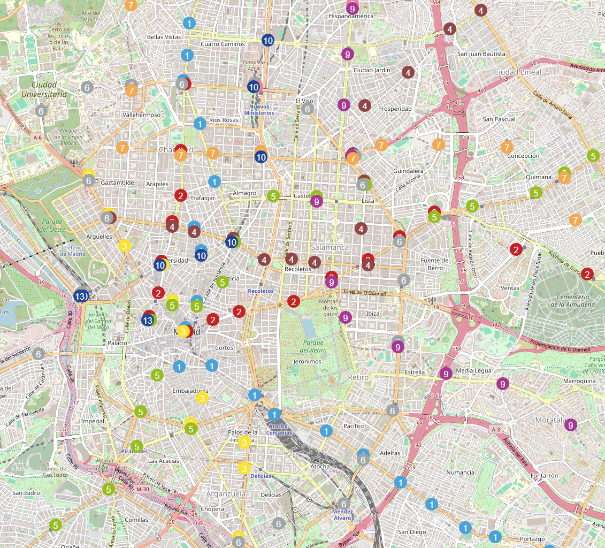

## Descripción

Este proyecto consiste en un conjunto de scripts en Python diseñados para extraer información sobre las estaciones del Metro de Madrid desde Wikipedia, y luego visualizarlas en un mapa interactivo.



Los dos scripts principales son:

- scrape.py: Se encarga de extraer y procesar la información de las estaciones del Metro de Madrid desde una página de Wikipedia y guardar esta información en un archivo JSON.

- stations_map.py: Utiliza la información extraída para generar un mapa interactivo utilizando la biblioteca folium. Este mapa muestra las estaciones de metro con iconos personalizados según la línea a la que pertenecen.

## Archivos

### scrape.py

Este script realiza las siguientes tareas:

- Scraping de Wikipedia: Se conecta a la página de Wikipedia que contiene la lista de estaciones del Metro de Madrid y extrae el nombre, color de la línea y las coordenadas de cada estación.

- Procesamiento de datos: Los datos se organizan en un diccionario, donde cada clave corresponde a una línea de metro y el valor es un diccionario con información de la línea y sus estaciones.

- Almacenamiento: La información extraída y procesada se guarda en un archivo JSON llamado lineas.json.

- Identificación de estaciones en múltiples líneas: Agrega un campo other_lines a cada estación que pertenece a más de una línea de metro.

### stations_map.py

Este script realiza las siguientes tareas:

- Carga de datos: Carga el archivo lineas.json generado por scrape.py.

- juste de coordenadas: Corrige las coordenadas de estaciones que comparten la misma ubicación para evitar la superposición de íconos en el mapa.

- Generación del mapa: Utiliza folium para crear un mapa interactivo de Madrid, donde cada estación de metro se representa con un ícono personalizado que indica la línea a la que pertenece. Las estaciones en múltiples líneas están indicadas en las descripciones emergentes (popups).

- Guardado del mapa: El mapa se guarda como un archivo HTML (mapa.html), que puede abrirse en cualquier navegador web.

## Requisitos

Python 3.x
Librerías:
beautifulsoup4
requests
folium
json

Puedes instalar las librerías necesarias ejecutando:

```bash
pip install beautifulsoup4 requests folium
```

## Instrucciones de Uso

1. Ejecutar scrape.py:

```bash
python scrape.py
```

Esto creará un archivo `lineas.json` con la información de las estaciones.

2. Ejecutar stations_map.py:

```bash
python stations_map.py
```

Esto generará un archivo `mapa.html` con un mapa interactivo de las estaciones del Metro de Madrid.

3. Ver el Mapa: 

Abre el archivo `mapa.html` en tu navegador para ver el mapa interactivo con todas las estaciones de metro.

## Notas

El script scrape.py realiza múltiples solicitudes HTTP, lo que puede llevar tiempo dependiendo de la conexión a internet.

Asegúrate de tener acceso a internet mientras ejecutas scrape.py, ya que el script necesita conectarse a Wikipedia para extraer la información.

`stations_map.py` depende del archivo lineas.json generado por scrape.py, por lo que scrape.py debe ejecutarse antes.

## Contribuciones

Las contribuciones son bienvenidas. Si tienes sugerencias o mejoras, no dudes en abrir un issue o enviar un pull request.

## Licencia
Este proyecto está bajo la Licencia MIT.